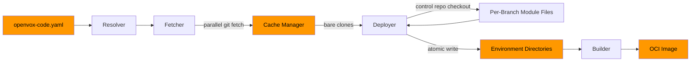

# Architecture

openvox-code is built around five core components that work together in a two-phase workflow.

## Core Components

### Resolver

The Resolver reads the configuration file and determines which modules, at which versions, need to be placed into which environments. It handles:

- Parsing `openvox-code.yaml` (with Kubernetes-style envelope support) and optional lockfiles
- Resolving branch names and tags to concrete Git SHAs
- Computing the full module list for each environment from module sets, inline modules, and per-branch module files
- Detecting conflicts (e.g., duplicate module names from different sources)
- Expanding branch discovery after fetching: listing branches from the cache, filtering through `branchSelector` patterns, and reading per-branch module files from the control repo

### Cache Manager

The Cache Manager maintains a directory of bare Git clones, providing a shared cache that avoids redundant network transfers. It handles:

- Creating and updating bare mirror clones for each unique Git URL
- Per-host credential resolution: selecting the right SSH key or credential helper based on the Git URL's host
- Retry with exponential backoff for transient network failures (up to 3 attempts with 1s, 2s, 4s backoff)
- Resolving refs (branches, tags, SHAs) to concrete commit SHAs within cached repositories
- Listing branches in cached repositories for branch discovery
- Checking out files from cached repos into target directories using `git archive`

### Fetcher

The Fetcher orchestrates parallel Git fetch operations using the Cache Manager. It:

- Collects all unique Git URLs from the resolved environments
- Fetches repositories concurrently using a semaphore to limit parallelism
- Delegates actual clone/fetch operations to the Cache Manager

### Deployer

The Deployer takes the resolved environment list and materializes it on disk. It:

- Checks out the control repo and modules from the bare clone cache into environment directories
- Reads per-branch module files from the checked-out control repo to discover additional modules
- Performs atomic deploys using temporary directories and renames
- Cleans up stale environments that no longer exist in the config or branches
- Can be run independently via `openvox-code deploy` (offline, from cache)

### Builder (OCI)

The Builder packages deployed environments into OCI container images for use with openvox-operator or any OCI-compatible runtime.

- Produces standard OCI images with Puppet code as the filesystem layer
- Supports tagging and pushing to container registries
- Supports multi-architecture image builds
- Run via `openvox-code build` and `openvox-code push`

## Two-Phase Workflow

openvox-code separates network operations (fetching) from local operations (deploying). This separation enables offline deployments and makes the tool more reliable in air-gapped or restricted environments.

### Phase 1: Mirror

Fetch all Git repositories into the local bare clone cache. This is the only phase that requires network access.

```bash
openvox-code mirror --config openvox-code.yaml
```

### Phase 2: Deploy

Read from the local cache and write environments to disk. No network access required. This phase includes:

1. Checking out the control repo for each environment
2. Reading per-branch module files from the control repo checkout
3. Resolving `follow_branch` modules to the environment's branch (with fallback)
4. Checking out all modules into the environment directory

```bash
openvox-code deploy --config openvox-code.yaml
```

### Combined

The `sync` command runs both phases in sequence:

```bash
openvox-code sync --config openvox-code.yaml
```

## Flow Diagram



The path from Environment Directories to Builder is optional -- OCI image output is only used when deploying to Kubernetes via openvox-operator.

## Directory Layout

After a successful sync, the on-disk layout looks like:

```
/etc/puppetlabs/code/environments/
├── production/
│   ├── manifests/
│   ├── modules/
│   │   ├── stdlib/
│   │   ├── apache/
│   │   └── ...
│   ├── site/                    # custom target_dir modules
│   │   ├── role/
│   │   └── profile/
│   └── environment.conf
├── staging/
│   ├── manifests/
│   ├── modules/
│   └── environment.conf
└── development/
    ├── manifests/
    ├── modules/
    └── environment.conf

/var/cache/openvox-code/
├── git/
│   ├── github.com-puppetlabs-puppetlabs-stdlib.git/
│   ├── github.com-puppetlabs-puppetlabs-apache.git/
│   └── ...
└── locks/
```
